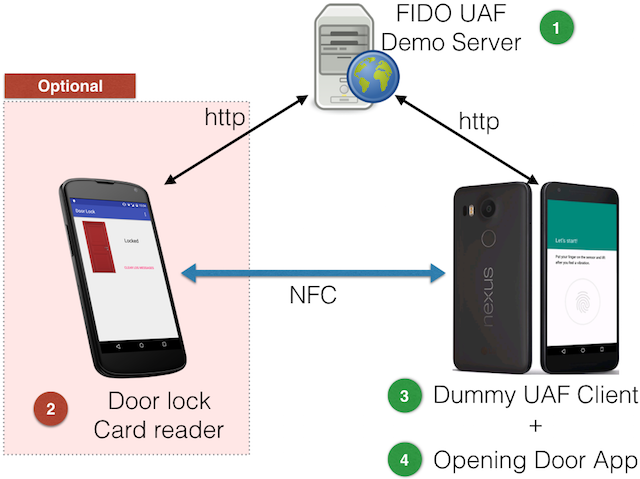
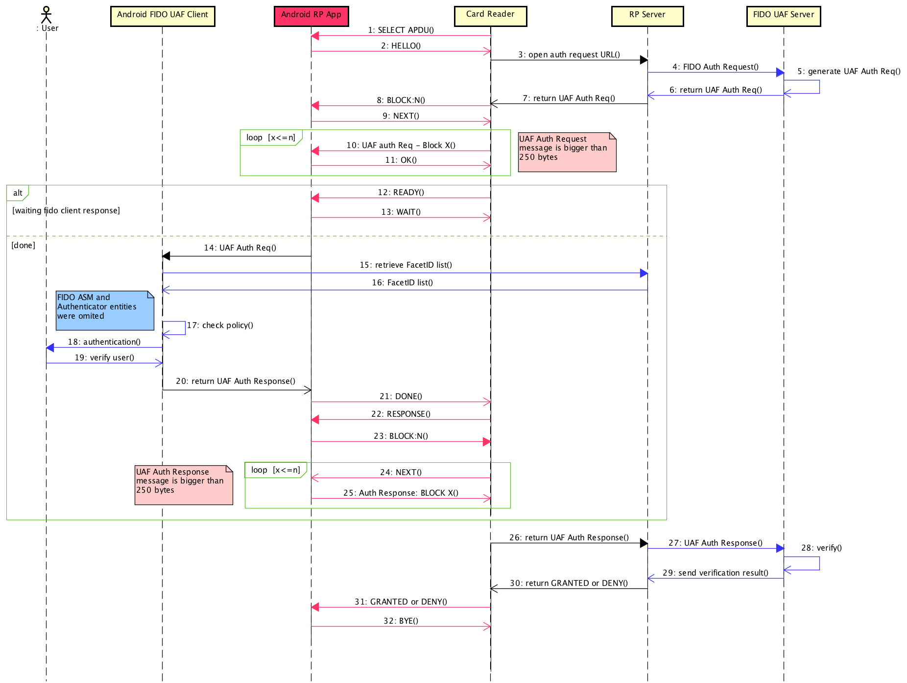

# Door lock NFC card for Android mobile phone

A simple application to demonstrate how to use FIDO UAF protocol and NFC on physical access control

- This client got some codes from [Daon Inc. Sample FIDO UAF App](https://github.com/daoninc/fido-android-rp-app), [eBay UAF open source project](https://github.com/eBay/UAF) and [Android Google Samples](https://github.com/googlesamples/android-AsymmetricFingerprintDialog)


**You can use this application without a [card reader](https://github.com/emersonmello/DoorlockCardReader)** if you only want to do tests about FIDO UAF Protocol. This application provides UI buttons that allow you to:

- Register a key at a [FIDO UAF Demo Server](https://github.com/emersonmello/UAF)
- Generate authentication requests to a [FIDO UAF Demo Server](https://github.com/emersonmello/UAF)
- DeRegister a key at a [FIDO UAF Demo Server](https://github.com/emersonmello/UAF)

## Motivation

Is it possible to use [FIDO UAF Standard](https://fidoalliance.org/specifications/download/) on an Android mobile + NFC to openning doors?

This project is a simple prototype to verify how FIDO could be used in this scenario (see [FIDO Security Reference](https://fidoalliance.org/specs/fido-uaf-v1.0-ps-20141208/fido-security-ref-v1.0-ps-20141208.html#threats-to-the-secure-channel-between-client-and-relying-party)). This [card reader](https://github.com/emersonmello/DoorlockCardReader) uses NFC to communicate with a specific [Android Opening Door App](https://github.com/emersonmello/openingdoor), that emulates a NFC card using Android's [Host-based Card Emulation](https://developer.android.com/guide/topics/connectivity/nfc/hce.html) functionality. 

[This application](https://github.com/emersonmello/openingdoor) depends of a third-party, called [FIDO UAF RP Server](https://github.com/emersonmello/UAF).

Figure below shows all necessary components and the relation between them



## Requirements

1. One Android mobile phone (with NFC) to acts like a card (Android OS >= 6 + Fingerprint sensor)
1. [Dummy FIDO UAF Client](https://github.com/emersonmello/dummyuafclient) installed on the same mobile phone 
1. One computer to host FIDO UAF Demo Server

### Optional

1. One Android mobile phone (with NFC) to acts like a card reader (Android OS >= 5)

## Getting necessary codes 

1. [FIDO UAF Demo Server](https://github.com/emersonmello/UAF)
  - If you prefer, there is a [Docker container](https://www.docker.com/what-docker) ready to use here: https://github.com/emersonmello/docker-fidouafserver
1. [Dummy FIDO UAF Client](https://github.com/emersonmello/dummyuafclient)
1. [Opening Door Android App](https://github.com/emersonmello/openingdoor) - You are already here!

### Optional

1. [Door lock NFC card reader for Android](https://github.com/emersonmello/DoorlockCardReader) 

## Setting up

1. Start **FIDO UAF Demo Server**
1. Install **Dummy FIDO UAF Client** and **Opening Door Android App** on your another Android phone
1. On **Opening Door Android App** touch on "Settings" on the main application menu and update "server endpoint" field to the **IP Address** and **PORT** where you are running the **FIDO UAF Demo Server**  
1. On **Opening Door Android App** touch on "See app facetID" on the main application menu and insert the showed value in FIDO UAF Demo Server MySQL database:
  - For instance: ```INSERT  INTO facets (fDesc) values ('android:apk-key-hash:Lir5oIjf552K/XN4bTul0VS3GfM')```

### Optional

1. Install [Door lock NFC card reader for Android](https://github.com/emersonmello/DoorlockCardReader)
1. On **Door lock card reader for Android** touch on "Settings" on the main application menu and update "server endpoint" field to the **IP Address** and **PORT** where you are running the **FIDO UAF Demo Server**


## Testing 

1. Open **Opening Door Android App** and touch "Register" button
1. Touch on "Do an authentication request"
1. Follow the instructions provided by application (i.e. put your finger on the sensor, etc.) and you should see the message "Access Granted"

## UML Sequence Diagram 




